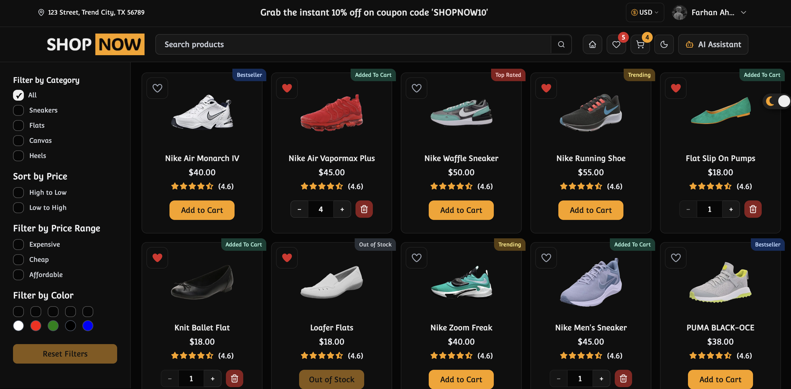

# ShopNow

ShopNow is a shoe storefront: browse and filter products, open product pages, manage cart and wishlist, sign in, and ask an in-page assistant about products.

This repo is two packages with no root workspace:

| Package   | Role                  | Dev URL                 |
| --------- | --------------------- | ----------------------- |
| `client/` | Next.js App Router UI | `http://localhost:3000` |
| `server/` | Express REST API      | `http://localhost:5001` |

The UI calls Express over Axios (`withCredentials: true`). JWT is stored in an HttpOnly cookie. Guest cart/wishlist live in Redux Persist (`localStorage`) and sync to the API after login.

`client/src/app/api/*` and `client/src/utils/supabase/` still talk to Supabase. Active shopping, auth, cart, wishlist, and feedback flows use Express.

## Stack

**Client:** Next.js 16, React 19, TypeScript, Tailwind CSS v4, shadcn/ui (New York), next-themes, Redux Toolkit, Redux Saga, redux-persist, TanStack Query, Axios, Framer Motion, Sonner.

**Server:** Express 5, TypeScript, Prisma 7, Neon (PostgreSQL) via `DATABASE_URL` and `@prisma/adapter-pg`, JWT (`jsonwebtoken`, `cookie-parser`), bcryptjs, Google OAuth (`google-auth-library`). ESLint, Prettier, Jest (configured; no tests).

**Assistant:** OpenRouter chat completions from the client (`useAiAssistant`).

## Layout

```
client/
  src/app/              # Routes: /, /cart, /wishlist, /products/[itemName]
  src/components/       # ui/, shared/, feature folders
  src/hooks/            # Data, filters, cart, search, virtualization, AI
  src/providers/        # Redux, Query, theme, auth, sync, navigation
  src/redux/            # store, slices/, sagas/; also cart/, wishlist/
  src/services/         # Axios API modules
  src/constants/        # API URLs, routes, filters, animations
  src/styles/           # globals.css, mediaQueries.css
  public/images/
server/
  src/server.ts         # Process entry
  src/app.ts            # CORS, cookies, route mount, /health
  src/routes/           # /auth /products /cart /wishlist /feedback
  src/controllers/
  src/middlewares/      # JWT protect, error handler
  src/config/db.ts      # Prisma client
  prisma/               # schema, migrations, seed
```

```
UI → hooks / AuthContext / Redux
       → services (Axios) → Express routes → controllers → Prisma → Neon (PostgreSQL)
AI sheet → OpenRouter
```

**Routes (client):** `/` home grid, `/products/[itemName]` details (ISR, `revalidate = 300`), `/cart`, `/wishlist`.

**Routes (server):**

- Auth: `POST /auth/signup` `POST /auth/login` `POST /auth/logout` `GET /auth/me` `GET /auth/google` `GET /auth/google/callback`
- Products: `GET /products` `GET /products/names` `GET /products/:itemName`
- Cart (auth): `GET|POST|PUT|DELETE /cart`
- Wishlist (auth): `GET|POST|DELETE /wishlist`
- Feedback (auth): `POST /feedback`
- Health: `GET /health`

## Setup

Requires Node. Both packages have `package-lock.json` and `bun.lock`; scripts below are npm.

### Server

```sh
cd server
npm install
```

Create `server/.env` (names only):

```
PORT
NODE_ENV
DATABASE_URL
JWT_SECRET
CLIENT_URL
GOOGLE_CLIENT_ID
GOOGLE_CLIENT_SECRET
GOOGLE_REDIRECT_URL
AUTH_COOKIE_NAME
```

`PORT` defaults to `5001`. `CLIENT_URL` defaults to `http://localhost:3000`. `AUTH_COOKIE_NAME` defaults to `jwt-token`.

```sh
npx prisma generate
npx prisma migrate dev
npm run seed:products
npm run dev
```

### Client

```sh
cd client
npm install
```

Create `client/.env.local` (names only):

```
NEXT_PUBLIC_SERVER_URL
NEXT_PUBLIC_OPENROUTER_API_KEY
NEXT_PUBLIC_OPENROUTER_MODEL
NEXT_PUBLIC_SUPABASE_URL
NEXT_PUBLIC_SUPABASE_ANON_KEY
```

`NEXT_PUBLIC_SERVER_URL` defaults to `http://localhost:5001`. Supabase vars are used by leftover Next route handlers, `utils/supabase/`, and `npm run seed`. Set `ANALYZE=true` to enable the Next bundle analyzer.

```sh
npm run dev
```

## Scripts

**Client:** `dev`, `build`, `start`, `lint`, `seed` (Supabase insert from `scripts/seed-products.ts`).

**Server:** `dev` (nodemon + ts-node), `build` (`prisma generate` + `tsc`), `start` (`node dist/server.js`), `lint`, `test`, `test:watch`, `seed:products`.

## Deploy

Axios calls `process.env.NEXT_PUBLIC_SERVER_URL` (see `client/src/constants/api.ts`). That value is baked in at Vercel build time. The live bundle uses Render.

| Piece    | Platform          | URL                                       |
| -------- | ----------------- | ----------------------------------------- |
| Client   | Vercel            | https://shopnow-lilac.vercel.app/         |
| API      | Render            | https://shopnow-backend-h1os.onrender.com |
| Database | Neon (PostgreSQL) | `DATABASE_URL`                            |

`GET /health` on the API returns `{ "status": "ok" }` with CORS origin `https://shopnow-lilac.vercel.app`. Local fallback is `http://localhost:5001`. No `vercel.json`, Render blueprint, or Docker files are in this repo.
